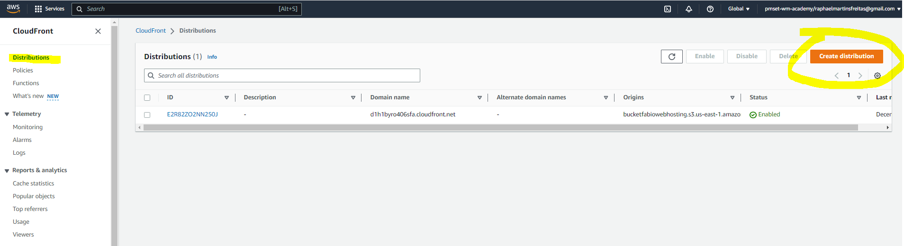

# HANDSON - Criando Distribuição

**Objetivo:** Vamos criar uma zona de distribuição usando cloudFront para se connectar no nosso bucket público

## Solução que vamos criar

**1)	Primeiro teste se seu site realmente está publico e se você consegue se conectar via navegador.**
Exemplo:
http://bucketfiapwebhosting.s3-website-sa-east-1.amazonaws.com/
**Resultado:**
 
**2)	Agora que seu site estático está configurado, vamos criar uma Distribuição via cloud front. Acesse o console da AWS e procure pelo serviço “CloudFront” e clique no botão “Create Distribution”**
 

**3)	Agora vamos configurar...**

  a.	Procure o bucket que vocês criaram com o site estático;
  b.	Vamos deixar as configurações Default neste momento;
  c.	Clique no final da página “Create Distribution”
Obs.: Em Origin Domain poderíamos colocar um outro endereço/IP de um website externo.
Origin Path: Se vc não colocar o path do seu arquivo main do seu site, vc vai precisar passar na URL, exemplo, http://bucket.rapha/index.html

**Resultado:**
 
**4)	Copie o endereço em amarelo que foi gerado pelo cloudFront.**

**5)	Vamos fazer agora um teste utilizando um terminal (Bash, CMD e etc) e executar o seguinte comando:**
curl -I -k https://d1h1byro406sfa.cloudfront.net/index.html
Obs.: Altere para o endereço do seu CDN

**Resultado:**
Você vai perceber vai retornar uma variável com esse conteúdo: 
*x-cache: Miss from cloudfront*
 
Isso significa que o Cloudfront ainda não acessou este website utilizando o cache, ele precisa ter o primeiro acesso para que o cache seja habilitado.

**6)	Execute o comando novamente e você vai perceber que o conteúdo mudou, ou seja, ele buscou de um edge location**
  

**What is the default TTL for CloudFront?**
*Minimum TTL: 1 second. Maximum TTL: 31,536,000 seconds (365 days). Default TTL: 86,400 seconds (24 hours).*
