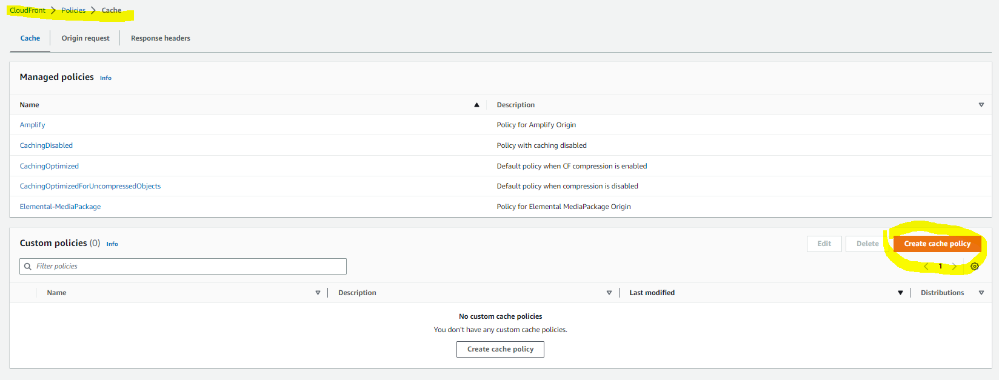
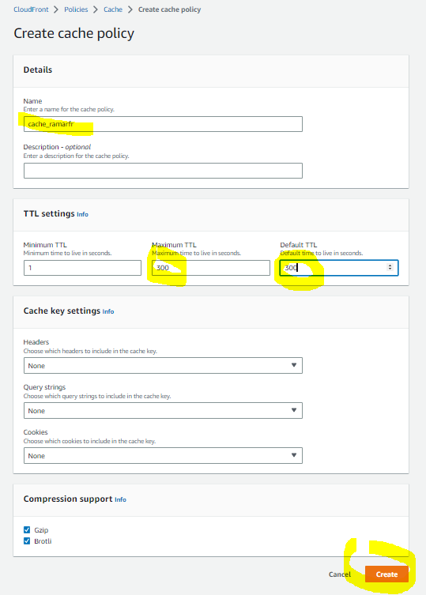
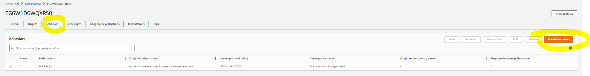
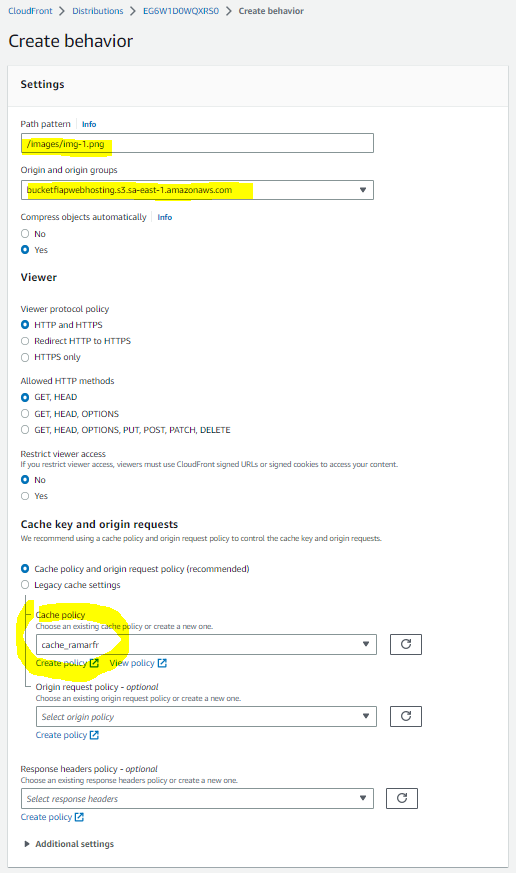
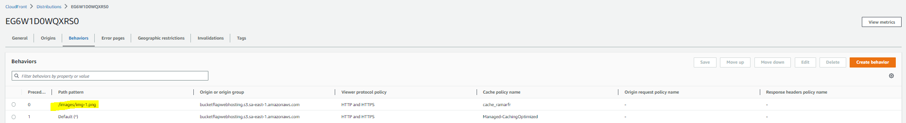
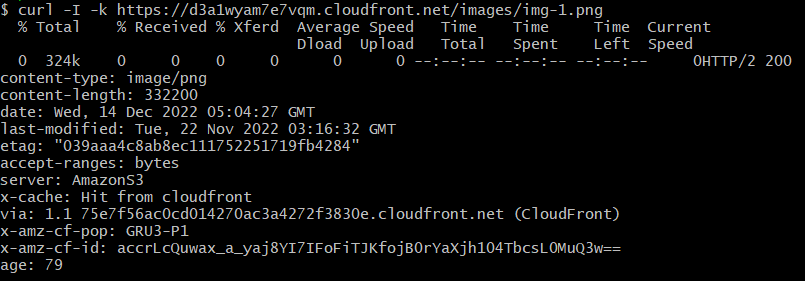
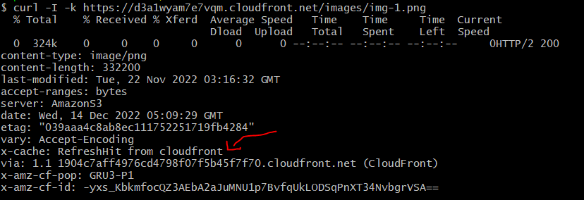

# Política de Cache
**Objetivo:** Vamos editar a politica de Cache
##Solução que vamos criar

**1)	Vamos acesso o console do cloudfront e vamos criar uma nova política**
 
 
**2)	Agora vamos acessar a sua distribuição, acessar a aba behaviors e clicar em Create**
  
  
 
**Resultado**
   
**3)	Vamos ver se o cache funcionou agora executando o comando abaixo colocando o endereço com o path que foi atribuído o cache**
*curl -I -k https://d3a1wyam7e7vqm.cloudfront.net/images/img-1.png*
   
**Resultado**
Após os 300 segundos de cache perceba que foi feito um refresh

 

