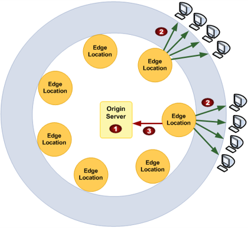

# AWS CloudFront

## Conceito
Amazon CloudFront é um serviço que acelera a distribuição do conteúdo estático e dinâmico da web, como arquivos .html, .css, .js e arquivos de imagem, para os usuários.
O CloudFront distribui o conteúdo por meio de uma rede global de datacenters denominados pontos de presença ou edge locations ou POPs. 

## CDN (Content Delivery Network) 
É uma Rede de Distribuição de Conteúdo é um grupo de servidores que permitem que os conteúdos da internet estejam facilmente disponíveis, com rapidez e segurança. A rede é a responsável por melhorar a experiência do usuário enquanto usa os recursos dela de forma eficiente.

[Fonte](https://www.hostinger.com.br/tutoriais/o-que-e-cdn?ppc_campaign=google_search_generic_hosting_all&bidkw=defaultkeyword&lo=1001773&gclid=CjwKCAiAv9ucBhBXEiwA6N8nYBDFYyxrl9sINhjClyO0GxOgwo0vtcWsaK9KIb7yH7E5h7x3uNbl7BoChVoQAvD_BwE)

## Como configurar o CloudFront para entregar conteúdo
Você cria uma distribuição do CloudFront para informar ao CloudFront de onde você deseja que o conteúdo seja entregue e os detalhes sobre como rastrear e gerenciar a entrega do conteúdo. O CloudFront usa os computadores, servidores de borda, que estão próximos dos visualizadores para entregar esse conteúdo rapidamente quando alguém desejar vê-lo ou usá-lo.

 
1. Especifique os servidores de origem, como um bucket do Amazon S3 ou seu próprio servidor HTTP, dos quais o CloudFront obtém os arquivos que serão distribuídos de pontos de presença do CloudFront no mundo todo. Um servidor de origem armazena a versão original e definitiva de seus objetos. Se você estiver fornecendo conteúdo por HTTP, o servidor de origem será um bucket do Amazon S3 ou servidor HTTP, como um servidor da web. Seu servidor HTTP pode ser executado em uma instância do Amazon Elastic Compute Cloud (Amazon EC2) ou em um servidor gerenciado por você. Esses servidores também são conhecidos como origens personalizadas.
2. Faça upload dos seus arquivos nos servidores de origem. Seus arquivos, também conhecidos como objetos, geralmente incluem páginas da Web, imagens e arquivos de mídia, mas podem ser qualquer coisa capaz de ser oferecida por HTTP. Se você estiver usando um bucket do Amazon S3 como servidor de origem, poderá tornar os objetos dele publicamente legíveis, para que qualquer pessoa com os URLs do CloudFront dos objetos possa acessá-los. Você também tem a opção de manter os objetos privados e controlar quem os acessa. 
3. Crie uma distribuição do CloudFront, que informa ao CloudFront de quais servidores de origem obter os arquivos quando os usuários os solicitam no site ou na aplicação. Especifique também detalhes, por exemplo, se deseja que o CloudFront registre todas as solicitações e que a distribuição seja ativada quando criada.
4. O CloudFront atribui um nome de domínio à nova distribuição que pode ser visto no console do CloudFront ou que é retornado na resposta a uma solicitação programática, por exemplo, uma solicitação de API. Em vez disso, se preferir, você pode adicionar um nome de domínio alternativo.
5. O CloudFront envia a configuração (mas não o conteúdo) da distribuição a todos os pontos de presença ou POPs, que são conjuntos de servidores em datacenters geograficamente dispersos nos quais o CloudFront armazena cópias dos objetos em cache.

## Edge Locations
- Edge Locations: Um site que o CloudFront usa para armazenar em cache cópias de seu conteúdo para uma entrega mais rápida aos usuários em qualquer local.
- Reginal Edge Caches:  Eles estão localizados entre seu servidor de origem e os POPs, locais de borda globais que fornecem conteúdo diretamente aos visualizadores
Obs.: Pontos de Presença (PoP, do inglês)

## Casos de uso do CloudFront
- **Acelerar a entrega de conteúdo de site estático.**
  - O CloudFront pode acelerar a entrega do conteúdo estático (por exemplo, imagens, folhas de estilo, JavaScript e assim por diante) para visualizadores no mundo todo. Ao usar o CloudFront, é possível aproveitar as vantagens da rede de estrutura da AWS e dos servidores de borda do CloudFront para oferecer aos seus visualizadores uma experiência rápida, segura e confiável ao visitar seu site.

- **Fornecer vídeos de streaming ao vivo ou sob demanda**
  - O CloudFront oferece várias opções de streaming de mídia para visualizadores globais, tanto de arquivos pré-gravados quanto de eventos ao vivo.

- **Criptografar campos específicos durante todo o processamento do sistema.**
  - Ao configurar o HTTPS com o CloudFront, você já terá conexões de ponta a ponta seguras com os servidores de origem. Ao adicionar criptografia no nível do campo, você poderá proteger dados específicos durante todo o processamento do sistema, além da segurança HTTPS, para que apenas determinados aplicativos na sua origem vejam os dados.

- **Personalizar na borda**
  - A execução de código sem servidor no ponto abre várias possibilidades para personalizar o conteúdo e a experiência dos espectadores com latência reduzida. Por exemplo, você pode retornar uma
mensagem de erro personalizada quando o servidor de origem estiver inativo para manutenção para que os visualizadores não recebam uma mensagem de erro HTTP genérica. Se preferir, você
pode usar uma função para ajudar a autorizar usuários e controlar o acesso ao seu conteúdo antes que o CloudFront encaminhe uma solicitação para a origem.

- **Fornecer conteúdo privado usando personalizações do Lambda@Edge**
  - Usar o Lambda@Edge pode ajudar você a configurar a distribuição do CloudFront para veiculação de conteúdo privado de sua própria origem personalizada, além de usar URLs assinados ou cookies
assinados.

## Definição de preços do CloudFront
- **Cobrança de armazenamento em um bucket do Amazon S3**
  - Você paga os encargos normais de armazenamento do Amazon S3 para armazenar objetos no bucket. As cobranças são exibidas na parte do Amazon S3 da sua fatura da AWS.
- **Cobrança por fornecimento de objetos de pontos de presença**
  - Você é cobrado pelo CloudFront quando ele responde a solicitações de seus objetos. As cobranças incluem transferência de dados para dados WebSocket do servidor para o cliente. As cobranças do CloudFront são exibidas na parte do CloudFront da fatura da AWS como região -DataTransfer-Out-Bytes.
- **Cobrança pelo envio de dados**
  - Você é cobrado pelo CloudFront quando os usuários transferem dados para sua origem ou função de borda, que inclui solicitações DELETE, OPTIONS, PATCH, POST e PUT. As cobranças incluem transferência de dados para dados WebSocket do cliente para o servidor

